---
## Front matter
title: "Лабораторная работа №1"
subtitle: "Работа с git"
author: "Перевощиков Данил Алексеевич"

## Generic otions
lang: ru-RU
toc-title: "Содержание"

## Bibliography
bibliography: bib/cite.bib
csl: pandoc/csl/gost-r-7-0-5-2008-numeric.csl

## Pdf output format
toc: true # Table of contents
toc-depth: 2
lof: true # List of figures
lot: true # List of tables
fontsize: 12pt
linestretch: 1.5
papersize: a4
documentclass: scrreprt
## I18n polyglossia
polyglossia-lang:
  name: russian
  options:
	- spelling=modern
	- babelshorthands=true
polyglossia-otherlangs:
  name: english
## I18n babel
babel-lang: russian
babel-otherlangs: english
## Fonts
mainfont: PT Serif
romanfont: PT Serif
sansfont: PT Sans
monofont: PT Mono
mainfontoptions: Ligatures=TeX
romanfontoptions: Ligatures=TeX
sansfontoptions: Ligatures=TeX,Scale=MatchLowercase
monofontoptions: Scale=MatchLowercase,Scale=0.9
## Biblatex
biblatex: true
biblio-style: "gost-numeric"
biblatexoptions:
  - parentracker=true
  - backend=biber
  - hyperref=auto
  - language=auto
  - autolang=other*
  - citestyle=gost-numeric
## Pandoc-crossref LaTeX customization
figureTitle: "Рис."
tableTitle: "Таблица"
listingTitle: "Листинг"
lofTitle: "Список иллюстраций"
lotTitle: "Список таблиц"
lolTitle: "Листинги"
## Misc options
indent: true
header-includes:
  - \usepackage{indentfirst}
  - \usepackage{float} # keep figures where there are in the text
  - \floatplacement{figure}{H} # keep figures where there are in the text
---

# Цель работы

Научиться пользоваться системой контроля версий Git.

# Ход работы

**1.** Инициализиурем репозиторий и делаем первый коммит. (рис. [-@fig:001])

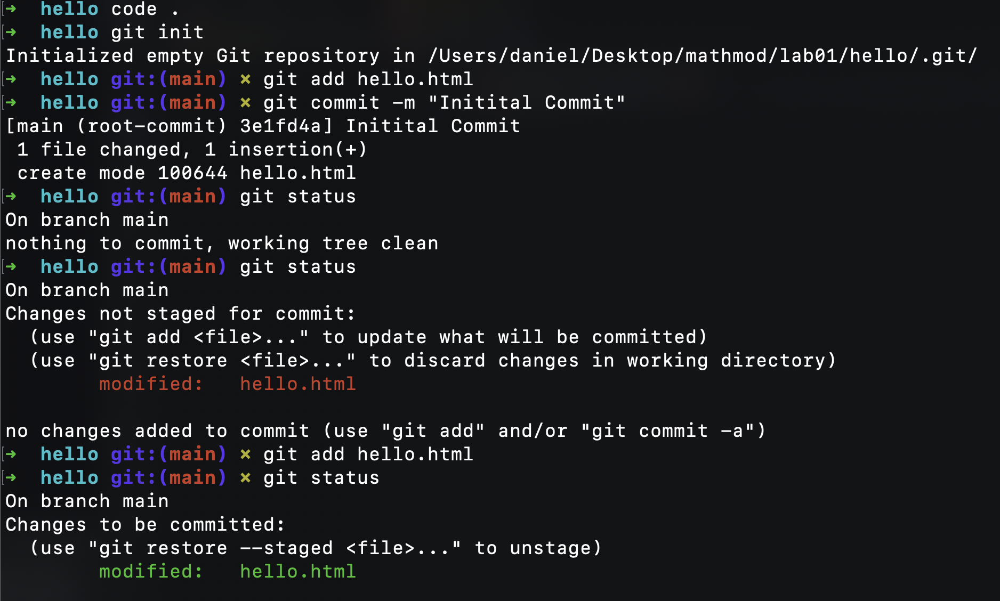{ #fig:001 width=70% }

**2.** Создаем hello.html.(рис. [-@fig:002])

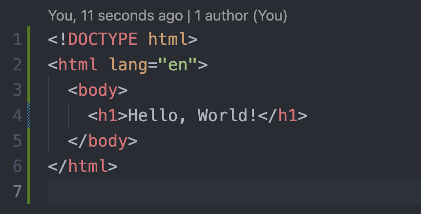{ #fig:002 width=70% }

**3.** Обновляем наш файл и делаем несколько коммитов.(рис. [-@fig:003])

{ #fig:003 width=70% }

**4.** Чекаутимся в коммит по хэшу. (рис. [-@fig:004])

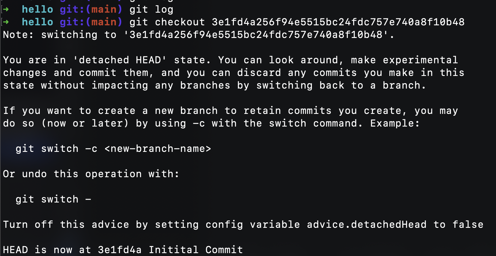{ #fig:004 width=70% }
  
**5.** Возвращаемся в main и создаем тэг v1. (рис. [-@fig:005])

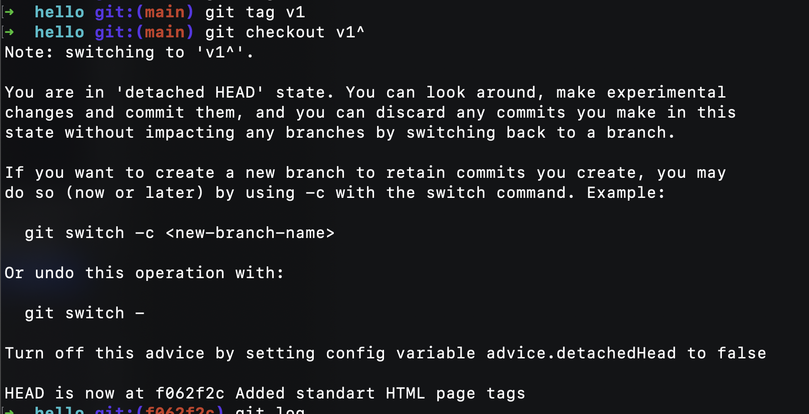{ #fig:005 width=70% }

**6.** Пишем ненужный комментарий в файле hello.html и ревертим его. (рис. [-@fig:006; -@fig:007; -@fig:008; -@fig:009])

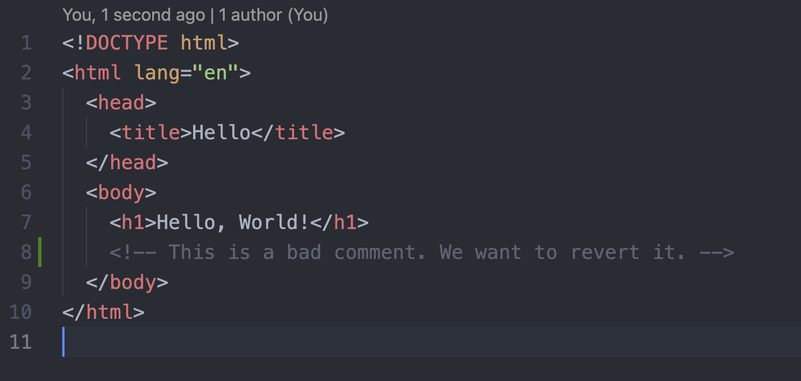{ #fig:006 width=70% }

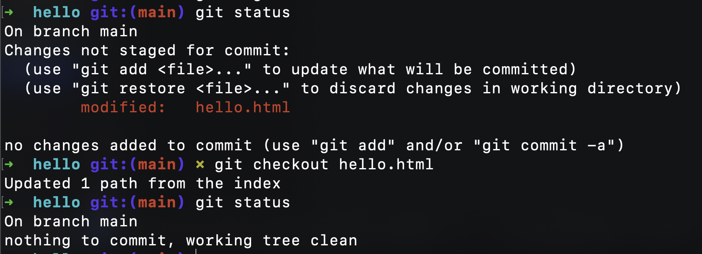{ #fig:007 width=70% }

{ #fig:008 width=70% }

{ #fig:009 width=70% }

**7.** Создаем новый тэг oops. Делаем жесткий ресет тэга v1. Далее удаляем тэг oops. (рис. [-@fig:010])

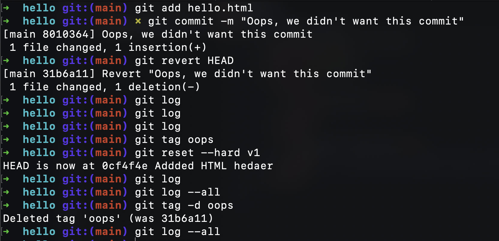{ #fig:010 width=70% }

**8.** Делаем коммит и переименовываем его. (рис. [-@fig:011])

{ #fig:011 width=70% }

**9.** Смотрим внутренности гита: просмотр хэшей коммитов, конфига, тэгов и тд. (рис. [-@fig:012])

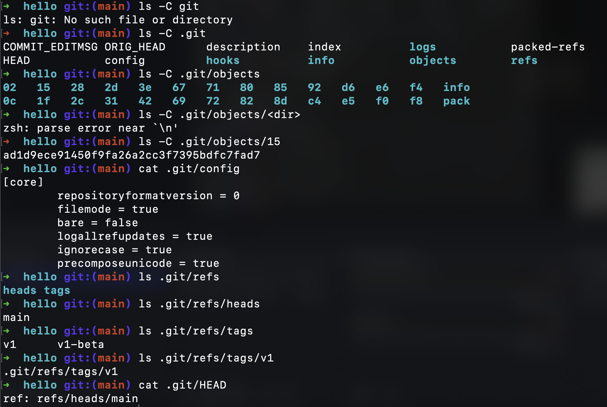{ #fig:012 width=70% }

**10.** Создаем новую ветку style и вней файл style.css, добавляем в него некоторые стили и подключаем их в hello.html. Делаем коммиты. (рис. [-@fig:013])

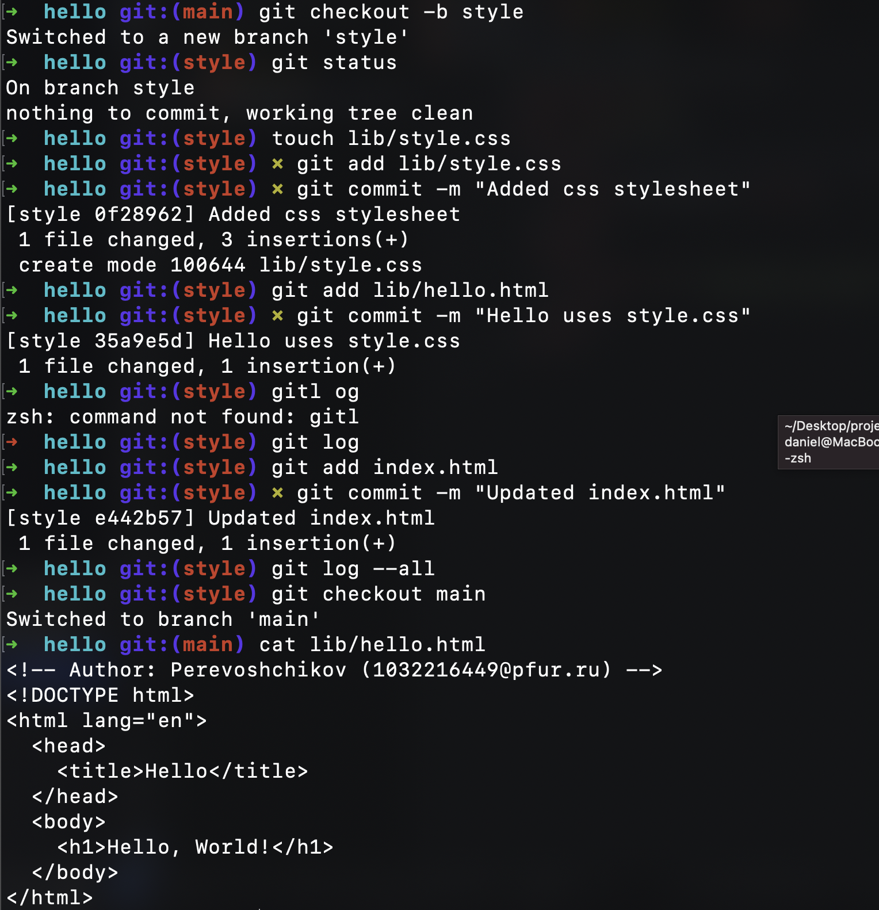{ #fig:013 width=70% }

**11.** Создаем специально конфликт в ветках, делаем мердж, получаем конфликт и решаем его. (рис. [-@fig:014])

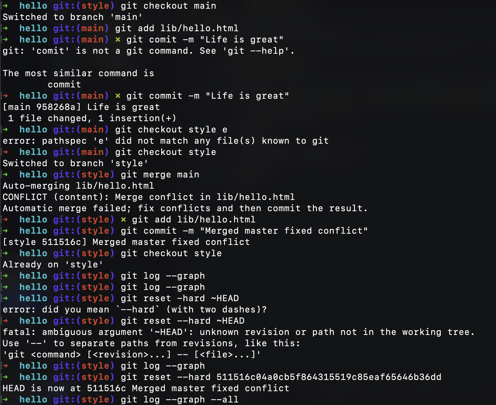{ #fig:014 width=70% }

**12.** Делаем мердж ветки style в ветку main. (рис. [-@fig:015])

{ #fig:015 width=70% }

**13.** Создаем копию репозитория и делаем remote. Далее смотрим какие ветки есть в клонированной версии. (рис. [-@fig:016])

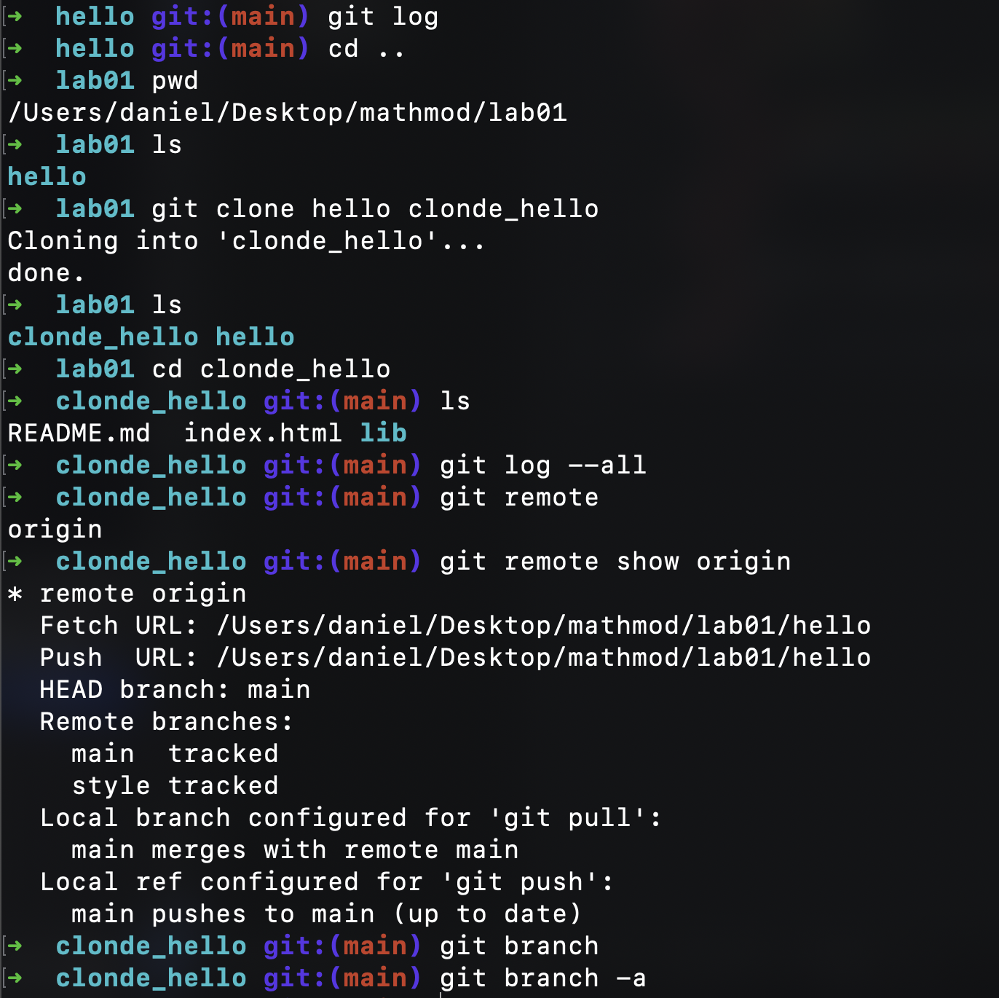{ #fig:016 width=70% }

**14.** Изменяем содержимое файла README.md в оригинальном репозитории. Делаем коммит, переходим в склонированную версию, делаем fetch и видим что изменения из оригниальной версии прилетели в клонированную. (рис. [-@fig:017])

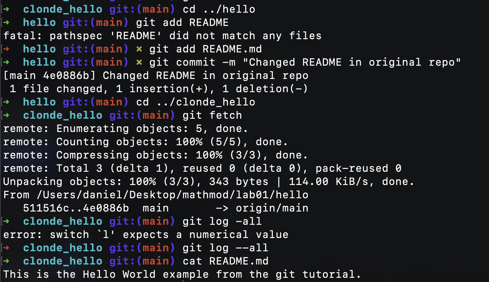{ #fig:017 width=70% }

**15.** Добавляем локальную ветку для наблюдения удаленной ветки и создаем чистый репозиторий. (рис. [-@fig:018])

{ #fig:018 width=70% }

**15.** Делаем коммит и пуш на удаленный репозиторий на GitHub. (рис. [-@fig:019])

{ #fig:019 width=70% }

# Вывод

Мы научились пользоваться системой контроля версий Git.