---
## Front matter
lang: ru-RU
title: Лабораторная работы №1"
author: Перевощиков Д. А.
institute: RUDN University, Moscow, Russian Federation
date: 10.02.2024
## Formatting
toc: false
slide_level: 2
theme: metropolis
header-includes: 
 - \metroset{progressbar=frametitle,sectionpage=progressbar,numbering=fraction}
 - '\makeatletter'
 - '\beamer@ignorenonframefalse'
 - '\makeatother'
aspectratio: 43
section-titles: true
---

## Цель работы

Научиться пользоваться системой контроля версий Git.

---

## Ход работы

Инициализиурем репозиторий и делаем первый коммит. (рис. [-@fig:001])

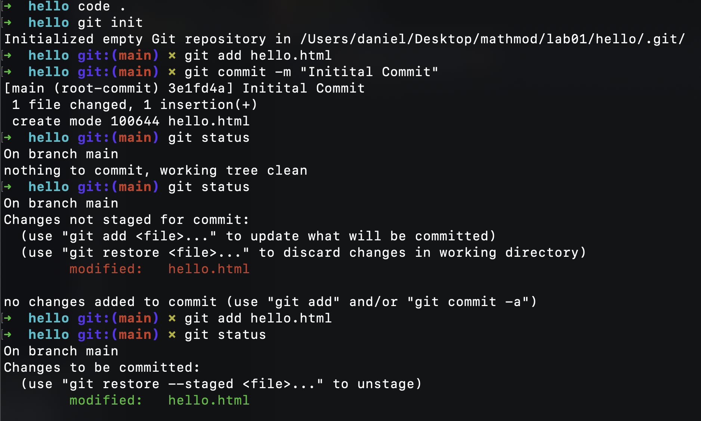{ #fig:001 width=70% }

---

## Ход работы

Создаем hello.html.(рис. [-@fig:002])

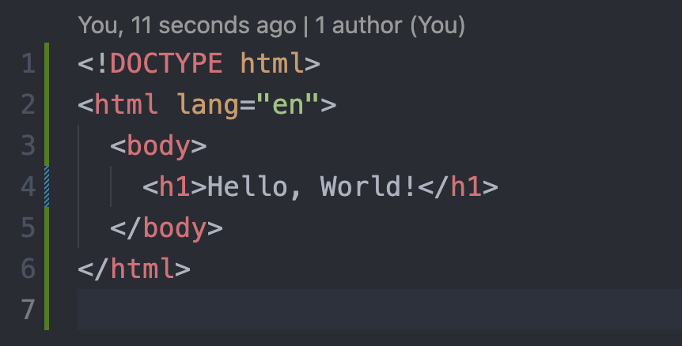{ #fig:002 width=70% }

---

## Ход работы

Обновляем наш файл и делаем несколько коммитов.(рис. [-@fig:003])

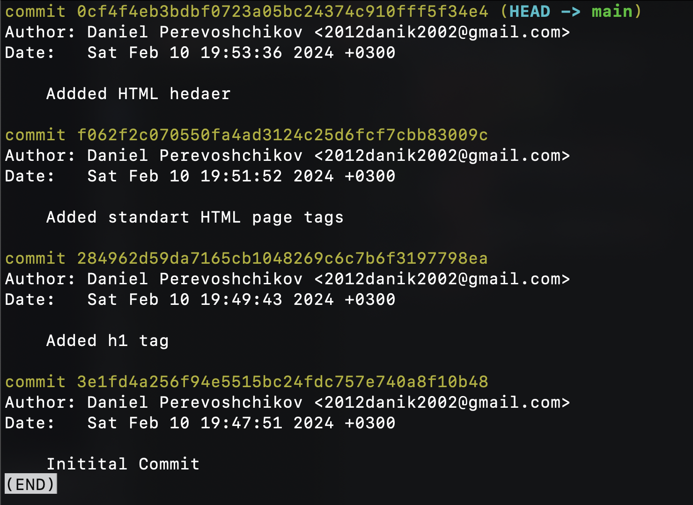{ #fig:003 width=70% }

---

## Ход работы

Чекаутимся в коммит по хэшу. (рис. [-@fig:004])

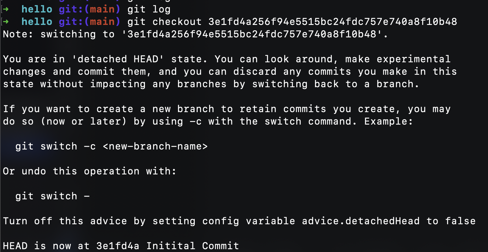{ #fig:004 width=70% }

---

## Ход работы

Возвращаемся в main и создаем тэг v1. (рис. [-@fig:005])

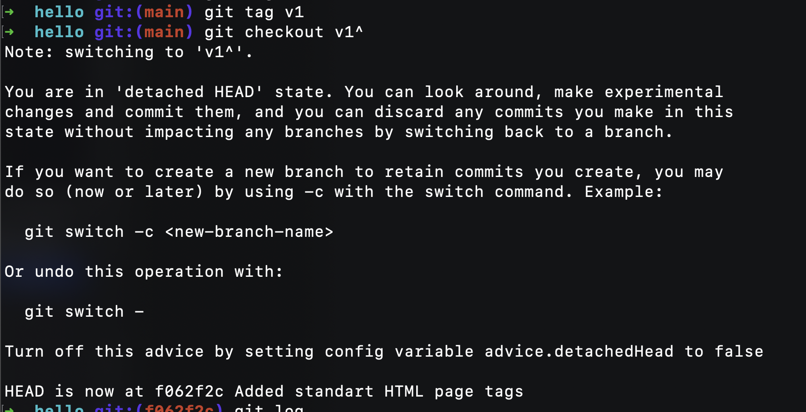{ #fig:005 width=70% }

---

## Ход работы

Пишем ненужный комментарий в файле hello.html и ревертим его. (рис. [-@fig:006; -@fig:007; -@fig:008; -@fig:009])

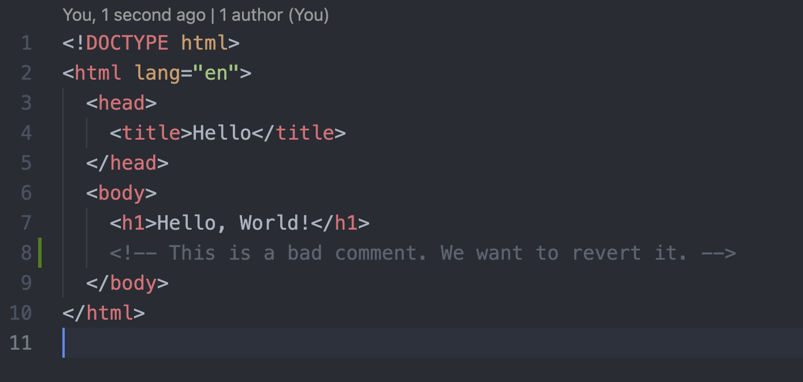{ #fig:006 width=70% }

---

## Ход работы

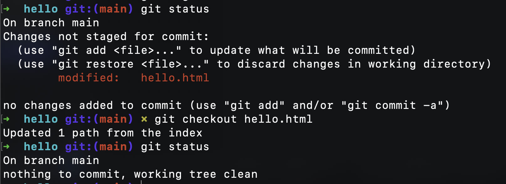{ #fig:007 width=70% }

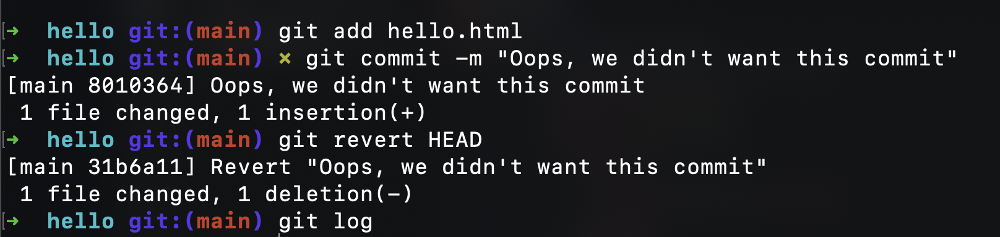{ #fig:008 width=70% }

---

## Ход работы

{ #fig:009 width=70% }

---

## Ход работы

Создаем новый тэг oops. Делаем жесткий ресет тэга v1. Далее удаляем тэг oops. (рис. [-@fig:010])

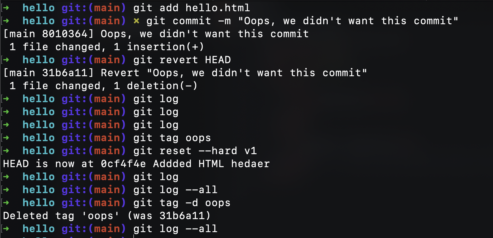{ #fig:010 width=70% }

---

## Ход работы

Делаем коммит и переименовываем его. (рис. [-@fig:011])

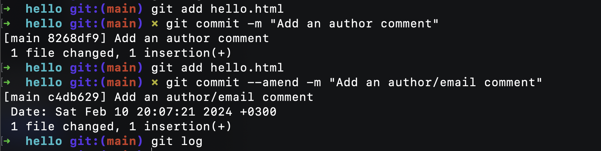{ #fig:011 width=70% }

---

## Ход работы

Смотрим внутренности гита: просмотр хэшей коммитов, конфига, тэгов и тд. (рис. [-@fig:012])

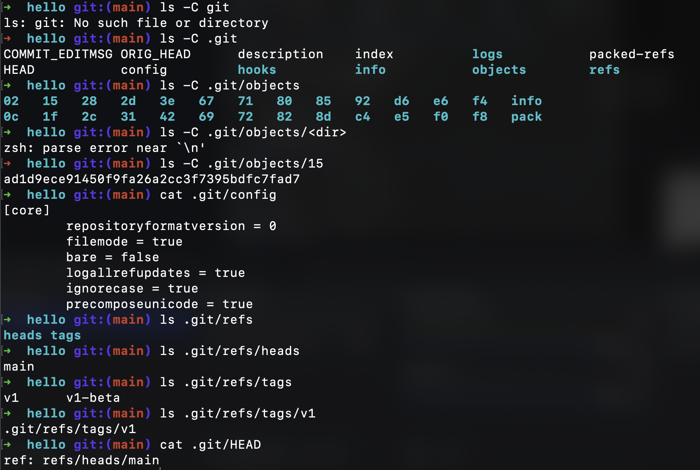{ #fig:012 width=70% }

---

## Ход работы

Создаем новую ветку style и вней файл style.css, добавляем в него некоторые стили и подключаем их в hello.html. Делаем коммиты. (рис. [-@fig:013])

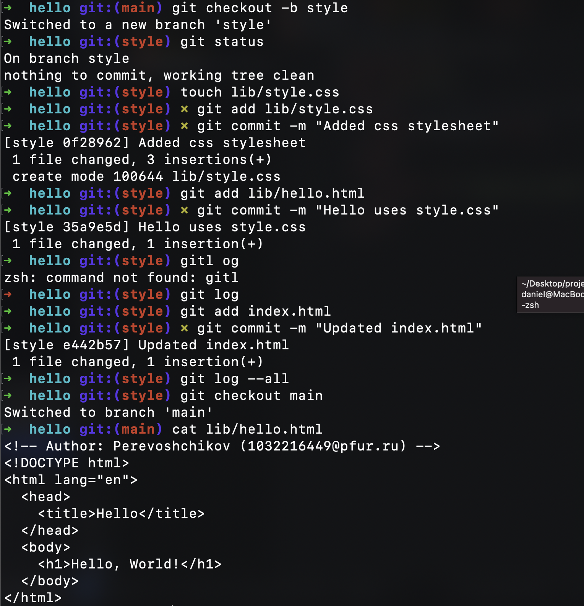{ #fig:013 width=50% }

---

## Ход работы

Создаем специально конфликт в ветках, делаем мердж, получаем конфликт и решаем его. (рис. [-@fig:014])

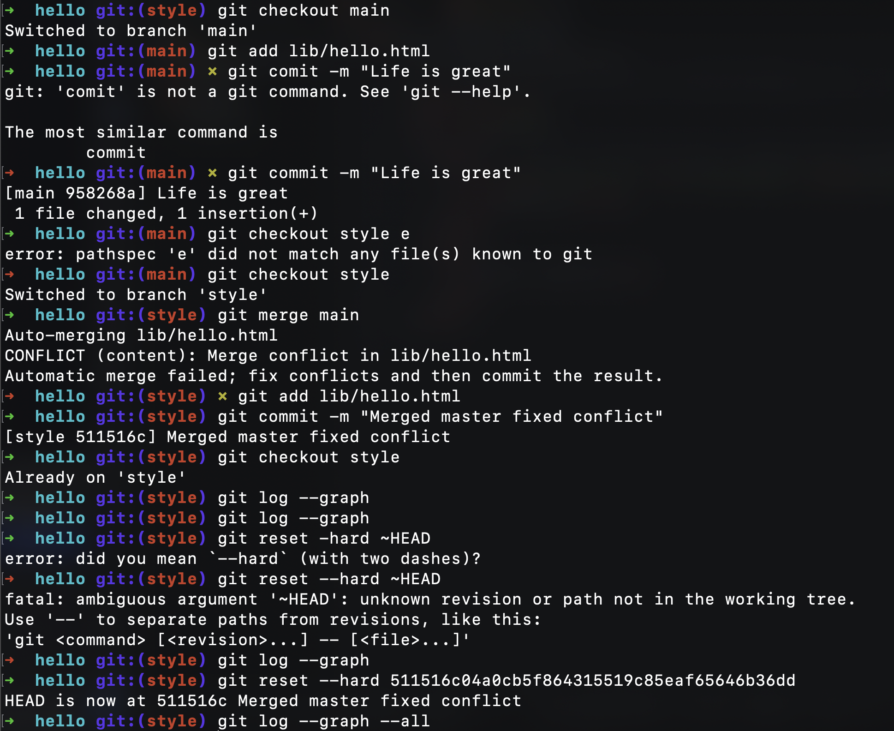{ #fig:014 width=70% }

---

## Ход работы

Делаем мердж ветки style в ветку main. (рис. [-@fig:015])

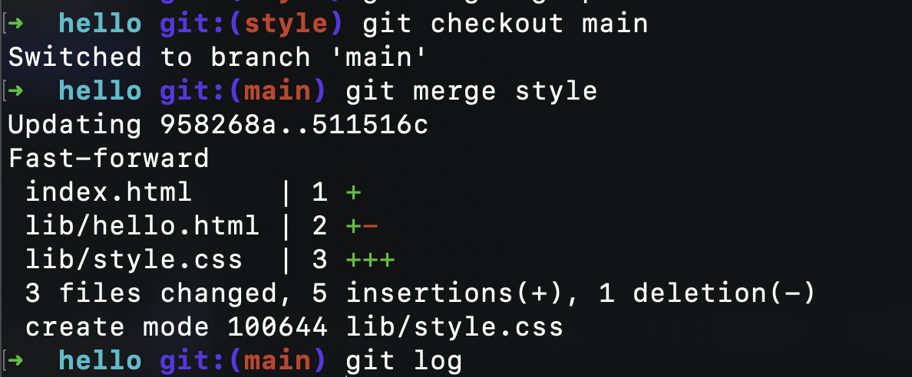{ #fig:015 width=70% }

---

## Ход работы

Создаем копию репозитория и делаем remote. Далее смотрим какие ветки есть в клонированной версии. (рис. [-@fig:016])

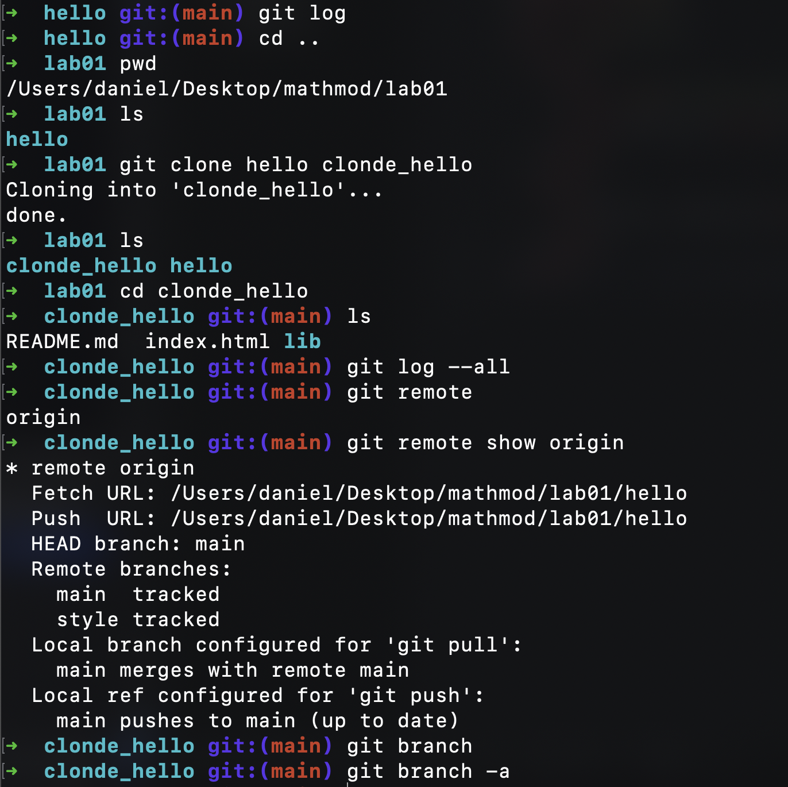{ #fig:016 width=70% }

---

## Ход работы

Изменяем содержимое файла README.md в оригинальном репозитории. Делаем коммит, переходим в склонированную версию, делаем fetch и видим что изменения из оригниальной версии прилетели в клонированную. (рис. [-@fig:017])

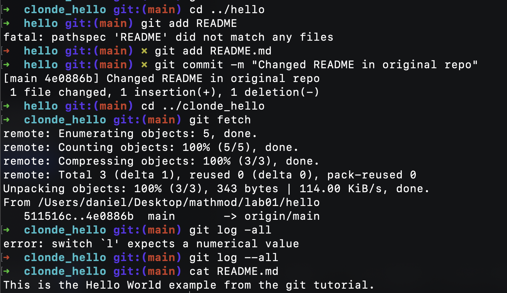{ #fig:017 width=70% }

---

## Ход работы

Добавляем локальную ветку для наблюдения удаленной ветки и создаем чистый репозиторий. (рис. [-@fig:018])

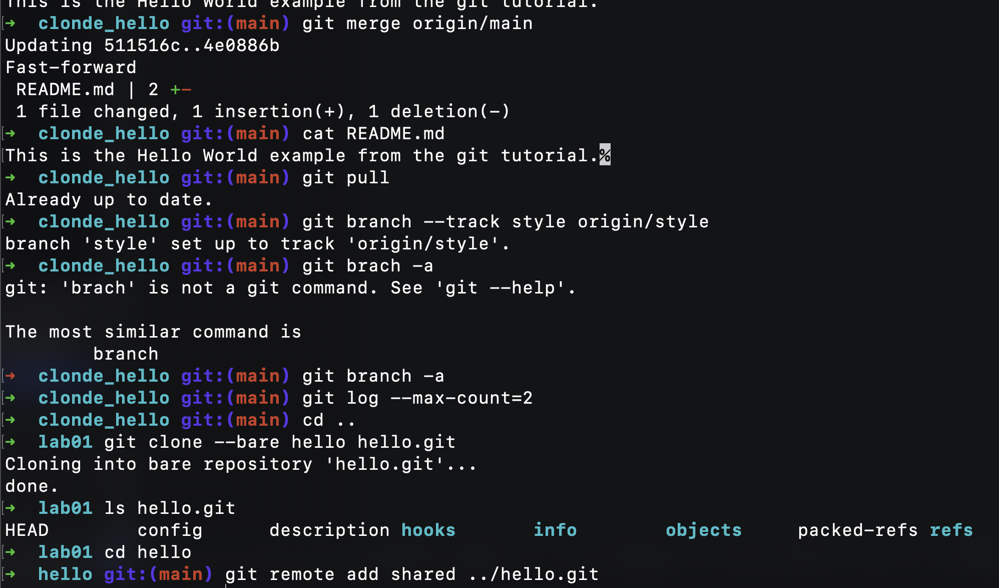{ #fig:018 width=70% }

---

## Ход работы

Делаем коммит и пуш на удаленный репозиторий на GitHub. (рис. [-@fig:019])

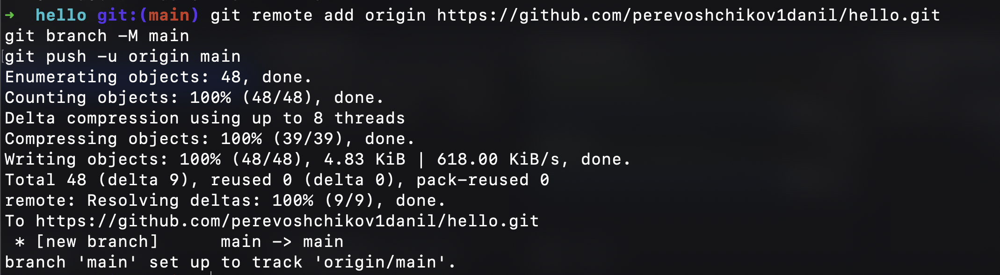{ #fig:019 width=70% }

---

## Вывод

Мы научились пользоваться системой контроля версий Git.